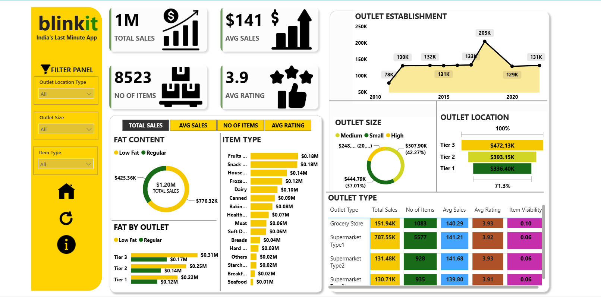

# 🛒 Blinkit Sales & Outlet Performance Dashboard

An interactive Power BI dashboard analyzing sales performance, outlet characteristics, and item-level trends for Blinkit ("India's Last Minute App").

## 🚀 Live Dashboard

**[View the live interactive dashboard here](https://app.powerbi.com/view?r=eyJrIjoiODIwZmZlODctNDU3ZC00MDRlLTk2ODYtYWU0ZjJmMzJlOTNlIiwidCI6ImUxNGU3M2ViLTUyNTEtNDM4OC04ZDY3LThmOWYyZTJkNWE0NiIsImMiOjEwfQ%3D%3D)**

"What This Dashboard Covers"
## 📝 Executive Summary

> A data-driven overview of sales performance, outlet distribution, and product trends derived from the Blinkit retail analytics dashboard.

🎯 **Key Performance Indicators** — Total Sales (**1M**), Average Sales (**$141**), Number of Items (**8,523**), and Average Rating (**3.9**) give a quick snapshot of overall business performance and customer satisfaction.

📊 **Sales & Product Trends** — The dashboard analyzes sales distribution across item types, fat content categories, outlet sizes, and outlet locations to identify major contributors to total sales, while also tracking outlet establishment trends over time to reveal business growth patterns.

🏬 **Outlet Comparison** — Side-by-side comparisons across different outlet types surface variations in total sales, item counts, average sales value, and customer ratings — helping identify high-performing store formats and product categories.

⚙️ **Technical Approach** — Built in **Power BI**, with data cleaned, transformed, and modeled, **DAX measures** powering the KPIs, and **interactive filters** letting users dynamically explore the data by outlet location, outlet size, and item type.

✅ **Bottom Line** — The dashboard converts raw retail data into actionable insights that support data-driven decision-making and retail performance optimization.
## 📊 What This Dashboard Covers

**Top-line KPIs**
- Total Sales, Average Sales per item
- Number of items tracked, Average customer rating

**Outlet Analysis**
- Outlet establishment trend over the years
- Breakdown by outlet size (Small / Medium / High)
- Sales distribution across outlet location tiers (Tier 1, 2, 3)
- Performance comparison across outlet types (Grocery Store, Supermarket Type 1/2/3) — sales, item count, rating, and item visibility

**Product Analysis**
- Sales by fat content (Low Fat vs Regular)
- Sales by item type (Fruits, Snacks, Dairy, Frozen, Household, etc.)
- Fat content breakdown by outlet tier

**Filters**
- Outlet Location Type, Outlet Size, Item Type — all fully interactive on the live dashboard

## 🛠️ Tech Stack

Power BI Desktop · Power Query · DAX

## 📁 Files

- `[your file name].pbix` — the full Power BI project file, open in Power BI Desktop to explore or edit
- `blinkit_dashboard.png` — static preview of the dashboard

## 📄 License

This project is for academic/educational purposes.
